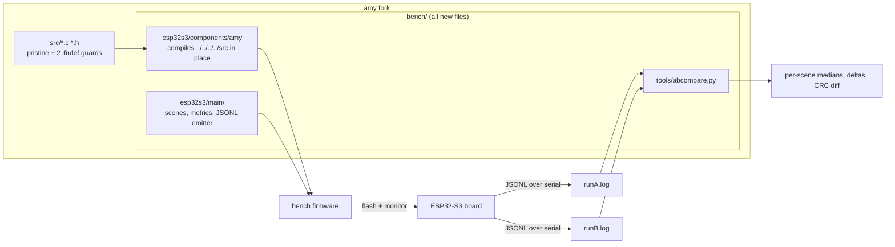

# amy-bench: on-target A/B performance benchmark (ESP32-S3)

Measures what an AMY DSP change actually costs on hardware. The harness
compiles this repository's `src/` tree in place as an ESP-IDF component,
runs deterministic synth scenes headless, and reports per-block wall time,
CPU cycles, and output CRCs over serial as JSONL. A host script diffs two
captures.

`src/` stays byte-identical to upstream except two documented `#ifndef`
config guards - see [AMY-EDITS.md](AMY-EDITS.md). Everything else is
additive under `bench/`, so merging upstream tags stays trivial.



## Quick start

```bash
cd bench/esp32s3
idf.py set-target esp32s3
idf.py build
idf.py -p /dev/ttyACM0 flash
idf.py -p /dev/ttyACM0 monitor | tee runA.log   # Ctrl-] after "run_end"
```

## A/B workflow

1. Capture a baseline (`runA.log`) with the code you're comparing against.
2. Make ONE change in `src/` (one branch/commit per experiment).
3. Rebuild, reflash, capture `runB.log`.
4. `python bench/tools/abcompare.py runA.log runB.log`

The compare script flags per-scene deltas above a noise threshold (default
3%), reports headroom against the real-time block budget, and diffs output
CRCs: a CRC change means the DSP change altered the rendered audio -
expected for a real algorithm change, a bug for a "pure" optimization.

Establish the noise floor first: capture the *same* binary twice and compare
those - deltas there are measurement noise, not signal.

## Build options (`idf.py menuconfig` -> "AMY Bench")

- **Pacing**: free-running (default; back-to-back blocks, max sensitivity)
  or GPTimer-paced at the real block period (headroom + overrun counting).
- **Float vs fixed-point**: upstream defaults to fixed-point; targets with a
  hardware FPU (like the S3 running the production firmware) use float
  (`CONFIG_BENCH_AMY_FLOAT=y`). Only compare like with like - the run
  header records the mode and `abcompare.py` warns on mismatch.
- **Profiler build** (`CONFIG_BENCH_PROFILE=y`): compiles upstream's
  `AMY_DEBUG` per-tag instrumentation and emits a per-tag breakdown per
  scene - shows *where* a delta comes from. It inflates absolute numbers
  (a timestamp read per profiled call), so keep profile captures separate
  from wall-time captures.
- **Sample rate**: default 48000; upstream's generic default is 44100.

## LTO profile

Cross-TU inlining changes codegen materially (loop forms, inlining depth),
so wins/losses should be confirmed under LTO before trusting them for an
LTO-enabled production build:

```bash
idf.py -D SDKCONFIG_DEFAULTS="sdkconfig.defaults;sdkconfig.defaults.lto" reconfigure
cp ../tools/build-patches/espressif__cmake_utilities-gcc.cmake \
   managed_components/espressif__cmake_utilities/gcc.cmake
idf.py build
```

The `gcc.cmake` copy is needed after every fresh component fetch
(`managed_components/` is generated): the published component's IPO check
fails against the ESP-IDF cross toolchain.

## Flashing over an existing firmware

Flashing the bench replaces the partition table and factory app on the
board. Data partitions of other firmware living above the 4 MB factory
slot are not touched at the flash level; reflashing that firmware (with its
own partition table) restores everything.

## Output format

See [tools/schema.md](tools/schema.md). Scenes are defined in
`esp32s3/main/scenes.c` as plain AMY wire-format messages - add new
workloads there.
