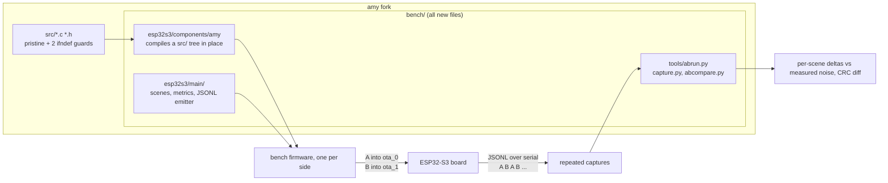

# amy-bench: on-target A/B performance benchmark (ESP32-S3)

Measures what an AMY DSP change actually costs on hardware. The harness
compiles this repository's `src/` tree in place as an ESP-IDF component,
runs deterministic synth scenes headless, and reports per-block wall time,
CPU cycles, and output CRCs over serial as JSONL. A host script diffs two
captures.

`src/` stays byte-identical to upstream except two documented `#ifndef`
config guards - see [AMY-EDITS.md](AMY-EDITS.md). Everything else is
additive under `bench/`, so merging upstream tags stays trivial.



## Quick start

One command builds both sides, flashes them into the two app slots, alternates
between them, and reports:

```bash
cd bench/esp32s3
source $IDF_PATH/export.sh
python ../tools/abrun.py --port /dev/ttyACM0 --head exp/faster-filter
```

`abrun.py` takes the *harness* from your working tree for both sides and swaps
only `src/`, so the two firmwares are measured with the same ruler even though
`bench/` may not exist on the baseline ref at all. The baseline defaults to the
merge base of the ref under test and `main`.

Baselines older than the guards in [AMY-EDITS.md](AMY-EDITS.md) - which is most
of them, since upstream carries neither - are handled automatically: `abrun.py`
applies the two `#ifndef` wrappers to the *materialised scratch tree* it just
extracted, never to your working tree. They change no instructions unless a
define is injected, and the same definitions go to both sides, so they cannot
bias the comparison. Without them a baseline would silently build at
44100/fixed-point and compare, looking perfectly healthy, against a 48000/float
head.

To build the firmware by hand instead (single side, manual capture):

```bash
idf.py build
idf.py -p /dev/ttyACM0 flash
python ../tools/capture.py --port /dev/ttyACM0 --out runA.log
```

`capture.py` replaces `idf.py monitor | tee` - it resets the board, records the
run, and stops on its own at the `run_end` footer, so it can be scripted.

## Reading the result

A delta is meaningless until you know how much the measurement wanders on its
own, so `abcompare.py` reports both, per scene:

```
scene         A med_cyc  B med_cyc     d_cyc    noise verdict
dx76             850121     765283    -9.98%   ±0.97% IMPROVEMENT
saw_lpf6         451409     442389    -2.00%   ±4.51% within noise
```

**noise** is the boot-to-boot spread of that side's own repeated measurements of
the same firmware. A delta that does not clear it is not a result, whatever its
sign. A verdict needs at least two captures per side (`--repeat 2`, default 3);
with one, `abcompare` withholds judgement rather than trusting a spread that can
only see a single boot.

Note the unit of measurement is the **median across one boot's passes**, not the
individual passes. Passes are not independent samples: some scenes cost
systematically more on a particular pass (`saw_lpf6`'s pass 1 runs ~4.6% hot,
reproducibly, on every boot and on *both* sides of an A/B). That is a fixed
property of the scene which cancels in a comparison; treating it as noise would
inflate the estimate ~500x and hide every real regression behind it.

It also diffs output CRCs: a CRC change means the DSP change altered the
rendered audio - expected for a real algorithm change, a bug for a "pure"
optimization.

## Known AMY gap: no FX state reset

**AMY has no way to reset effects state, and this is an upstream bug, not just a
bench inconvenience.** Reverb's ten delay lines and its four IIR filter states
(`reverb_params_t`, `src/amy.h`) are zeroed exactly once, at allocation - the
`bzero` in `new_reverb()` and the clearing loop in `new_delay_line()`, both in
`src/delay.c` - and never again. Chorus is the same. Nothing in AMY's `RESET_*`
vocabulary (`RESET_AMY`, `RESET_TIMEBASE`, `RESET_EVENTS`, `RESET_SYNTHS`)
touches them.

Turning an effect off (`h0`, `k0`) only stops it being *processed*. The tail
does not drain - it freezes in the buffers, and is still sitting there when the
effect is switched back on. Any host that reuses an AMY instance across songs
inherits the previous one's reverb tail.

The visible symptom here is `fx_sine8`, the only scene with reverb and chorus:
each pass starts the reverb from the previous pass's leftovers, so each pass
renders different audio (`60c02a8e`, `a50befbc`, `d9cac803`). Every other scene
is bit-identical across passes, which is what isolates FX state as the cause -
`sine8` is the same eight oscillators with the effects switched off, and it is
perfectly stable.

This is **not** measurement error. Each pass is bit-identical across boots (10/10
captures), so `abcompare.py` compares the two sides pass by pass and keeps a
fully working output oracle for the scene. Its timing is unaffected and as solid
as any other scene (±0.01% boot-to-boot), so `fx_sine8` stays in the scene list
and needs no special handling from you.

The upstream fix is a reset that zeroes the FX delay lines and filter states,
slotting into the existing `RESET_*` flags for a scene teardown to call. Until
then, do not read `fx_sine8`'s three per-pass CRCs as a fault.

## Measured noise floor

Both numbers below come from this harness on an ESP32-S3 (240 MHz, octal PSRAM),
free-running, fixed-point, 5 captures per side:

| source of error | measured | how |
|---|---|---|
| boot-to-boot, same binary | **±0.01%** | `--base HEAD --head HEAD` - identical images, one per OTA slot |
| relink / code layout | **≤0.07%** | identical `src/`, binary relinked (a 64-byte shift) |

The default `--threshold 0.5` is derived from the second number, not the first,
and that distinction matters: repeated boots of *one* binary can never reveal
layout noise, because layout is fixed per binary. It lands in the **delta**, not
in the noise column. So the boot floor tells you the instrument is sound; only
the relink floor tells you what a delta has to clear.

Re-derive both if you change the board, the scene set, or the build profile:

```bash
python ../tools/abrun.py --port /dev/ttyACM0 --base HEAD --head HEAD --repeat 5
```

Every scene must come back `within noise` with identical CRCs. If it does not,
nothing else the tool says counts.

## Two app slots

The partition table carries `ota_0` and `ota_1` rather than one `factory` app,
so `abrun.py` can keep both firmwares on the board at once and alternate with a
boot-slot switch and a reset (about a second) instead of a ~20s reflash. Cheap
repeats are the point: the noise estimate above needs samples, and interleaving
A B A B keeps board drift from masquerading as the change under test.

## Build options (`idf.py menuconfig` -> "AMY Bench")

- **Pacing**: free-running (default; back-to-back blocks, max sensitivity)
  or GPTimer-paced at the real block period (headroom + overrun counting).
- **Float vs fixed-point**: upstream defaults to fixed-point; targets with a
  hardware FPU (like the S3 running the production firmware) use float
  (`CONFIG_BENCH_AMY_FLOAT=y`). Only compare like with like - the run
  header records the mode and `abcompare.py` warns on mismatch.
- **Profiler build** (`CONFIG_BENCH_PROFILE=y`): compiles upstream's
  `AMY_DEBUG` per-tag instrumentation and emits a per-tag breakdown per
  scene - shows *where* a delta comes from. It inflates absolute numbers
  (a timestamp read per profiled call), so keep profile captures separate
  from wall-time captures.
- **Sample rate**: default 48000; upstream's generic default is 44100.

## LTO profile

Cross-TU inlining changes codegen materially (loop forms, inlining depth),
so wins/losses should be confirmed under LTO before trusting them for an
LTO-enabled production build:

```bash
idf.py -D SDKCONFIG_DEFAULTS="sdkconfig.defaults;sdkconfig.defaults.lto" reconfigure
cp ../tools/build-patches/espressif__cmake_utilities-gcc.cmake \
   managed_components/espressif__cmake_utilities/gcc.cmake
idf.py build
```

The `gcc.cmake` copy is needed after every fresh component fetch
(`managed_components/` is generated): the published component's IPO check
fails against the ESP-IDF cross toolchain.

## Flashing over an existing firmware

Flashing the bench replaces the partition table and the app slots on the
board. Data partitions of other firmware living above the bench's own
partitions are not touched at the flash level; reflashing that firmware (with
its own partition table) restores everything.

## Output format

See [tools/schema.md](tools/schema.md). Scenes are defined in
`esp32s3/main/scenes.c` as plain AMY wire-format messages - add new
workloads there.
