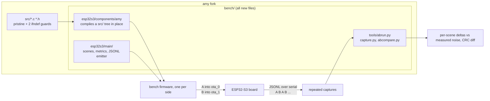

# amy-bench: on-target A/B performance benchmark (ESP32-S3)

Measures what an AMY DSP change actually costs on hardware. The harness compiles
this repository's `src/` tree in place as an ESP-IDF component, runs
deterministic synth scenes headless, and reports per-block wall time, CPU
cycles, and output CRCs over serial as JSONL. `abrun.py` drives the whole A/B:
two git refs in, one report out.

`src/` stays byte-identical to upstream except two documented `#ifndef` config
guards - see [AMY-EDITS.md](AMY-EDITS.md). Everything else is additive under
`bench/`, so merging upstream tags stays trivial.



## Prerequisites

- **ESP-IDF 6.0**, target `esp32s3`. Source its `export.sh` before anything else.
- **An ESP32-S3 with 16 MB flash and octal PSRAM** (matching the production
  S3-Amysynth board), on a serial port.
- **pyserial**, in the *interpreter that runs `abrun.py`*. It ships in the IDF
  python env, and sourcing `export.sh` puts that env on `PATH`, so a plain
  `python3` after sourcing already has it. `abrun.py` checks for it up front
  rather than after spending minutes on builds.
- On WSL the board must be attached to the VM first (`usbipd attach` from an
  admin PowerShell), or no `/dev/ttyACM*` will exist.

## Quick start

One command builds both sides, flashes them into the two app slots, alternates
between them, and reports:

```bash
cd bench/esp32s3
source $IDF_PATH/export.sh
python ../tools/abrun.py --port /dev/ttyACM0 --head exp/faster-filter
```

Logs and `compare.json` land in `bench/tools/abrun-out/` (`--outdir` to change).

`abrun.py` takes the *harness* from your working tree for both sides and swaps
only `src/`, so the two firmwares are measured with the same ruler even though
`bench/` may not exist on the baseline ref at all. Each side's `src/` is
extracted with `git archive` into a scratch tree, so your working tree is never
touched - and `--head` defaults to the working tree, so uncommitted experiments
are measurable without committing first.

Baselines older than the guards in [AMY-EDITS.md](AMY-EDITS.md) - which is most
of them, since upstream carries neither - are handled automatically: `abrun.py`
applies the two `#ifndef` wrappers to that throwaway scratch tree. They change
no instructions unless a define is injected, and the same definitions go to both
sides, so they cannot bias the comparison. Without them a baseline would
silently build at 44100/fixed-point and compare, looking perfectly healthy,
against a 48000/float head.

## Running an experiment

1. Branch from the ref you want to beat, and make **one** change in `src/`. One
   experiment per branch keeps the attribution honest.
2. Run the A/B. The baseline defaults to the merge base of your branch and
   `main`, which is usually what you want:

   ```bash
   python ../tools/abrun.py --port /dev/ttyACM0 --head exp/my-change --repeat 5
   ```

3. Read the verdict (below). If a scene moved, ask whether its CRC moved too.
4. To see *where* the time went, rerun the same pair with `--profile` for a
   per-tag breakdown. Keep those captures separate: the instrumentation adds a
   timestamp read per profiled call and inflates absolute numbers.

## Reading the result

A delta is meaningless until you know how much the measurement wanders on its
own, so `abcompare.py` reports both, per scene:

```
scene         A med_cyc  B med_cyc     d_cyc    noise verdict
dx76             850121     765283    -9.98%   ±0.01% IMPROVEMENT
juno6           1159320    1159402    +0.01%   ±0.01% within noise
saw_lpf6         442452     442450    -0.00%   ±0.01% within noise
```

**noise** is the boot-to-boot spread of that side's own repeated measurements of
the same firmware - what the number does when nothing changed.

| verdict | meaning |
|---|---|
| `within noise` | the delta does not clear the scene's own spread. Not a result, whatever its sign. |
| `small` | clears the noise but is below `--threshold`. Real, but minor. |
| `REGRESSION` / `IMPROVEMENT` | clears the noise **and** the threshold. |
| `1 capture` | judgement withheld: one capture per side cannot estimate noise (see below). |

A verdict needs at least two captures per side (`--repeat 2`; default 3). With
one, the only spread available is *between passes of a single boot*, which can
see neither reboot nor relink effects and therefore understates the real noise -
so `abcompare` withholds judgement rather than trust it.

The unit of measurement is the **median across one boot's passes**, not the
individual passes. Passes are not interchangeable samples: some scenes cost
systematically more on a particular pass (`saw_lpf6`'s pass 1 runs ~4.6% hot,
reproducibly, on every boot and on *both* sides of an A/B). That is a fixed
property of the scene which cancels in a comparison; pooling it into the noise
estimate would inflate it ~500x and hide every real regression behind it.

The `output` column diffs the rendered audio's CRC, pass by pass. A change there
means the DSP change altered the audio: expected for a real algorithm change, a
**bug** for a supposedly-pure optimization. Do not accept "faster" without
deciding which of the two it is.

## Measured noise floor

From this harness on an ESP32-S3 (240 MHz, octal PSRAM), free-running,
fixed-point, 5 captures per side:

| source of error | measured | how |
|---|---|---|
| boot-to-boot, same binary | **±0.01%** | `--base HEAD --head HEAD` - identical images, one per OTA slot |
| relink / code layout | **≤0.07%** | identical `src/`, binary relinked (a 64-byte shift) |

The default `--threshold 0.5` is derived from the second number, not the first,
and the distinction is the whole point: repeated boots of *one* binary can never
reveal layout noise, because layout is fixed per binary. It lands in the
**delta**, never in the noise column. So the boot floor tells you the instrument
is sound; only the relink floor tells you what a delta has to clear.

Re-derive both if you change the board, the scene set, or the build profile:

```bash
# null test: identical binaries, one per slot
python ../tools/abrun.py --port /dev/ttyACM0 --base HEAD --head HEAD --repeat 5
```

Every scene must come back `within noise` with identical CRCs. This also
confirms that which OTA slot a firmware runs from does not affect its speed -
the assumption the two-slot design rests on. If it fails, nothing else the tool
says counts.

## `abrun.py` options

| flag | default | notes |
|---|---|---|
| `--port` | - | required unless `--build-only` |
| `--head REF` | working tree | ref under test |
| `--base REF` | merge-base of head and `main` | baseline |
| `--repeat N` | 3 | captures per side, interleaved A B A B. 2 is the minimum that yields a verdict. |
| `--passes N` | 3 | scene-list repetitions *inside* one run |
| `--threshold PCT` | 0.5 | regression threshold; see the noise floor above |
| `--float` | off (fixed-point) | production runs float on the S3's FPU |
| `--paced` | off (free-running) | GPTimer-paced at the real block period: headroom and overrun counting |
| `--profile` | off | per-tag `AMY_DEBUG` breakdown; inflates absolute numbers |
| `--lto` | off | also applies the `gcc.cmake` patch; see LTO below |
| `--build-only` | - | build both sides and stop, no board needed |
| `--outdir DIR` | `tools/abrun-out` | where logs and `compare.json` go |
| `--timeout SEC` | 180 | per-capture; a wedged board fails rather than hangs |
| `--quiet` | - | do not mirror the serial stream while capturing |

Build options are set **identically on both sides** by these flags. Note this
means `idf.py menuconfig` does **not** affect an `abrun` build: it generates a
fresh sdkconfig per side from `sdkconfig.defaults` plus an overlay, precisely so
the two sides cannot drift apart. Use menuconfig only for hand-built single-side
runs. Either way `abcompare` re-checks the two run headers and shouts `RUN CONFIG
MISMATCH` if the firmwares disagree about sample rate, block size, pacing,
arithmetic mode or profiling.

## Working by hand (single side)

```bash
idf.py build
idf.py -p /dev/ttyACM0 flash
python ../tools/capture.py --port /dev/ttyACM0 --out runA.log
python ../tools/abcompare.py -A runA.log runA2.log -B runB.log runB2.log
```

`capture.py` replaces `idf.py monitor | tee` - it resets the board, records the
run, and stops on its own at the `run_end` footer, so it can be scripted. It
exits non-zero on timeout, so "the board is wedged" is distinguishable from
"the run was slow".

`abcompare.py` also takes `--metric us` (default `cyc`; the cycle counter is
less jittery than wall time) and `--json PATH` for machine-readable output.

## LTO profile

Cross-TU inlining changes codegen materially (loop forms, inlining depth), so
wins and losses should be confirmed under LTO before they are trusted for an
LTO-enabled production build. `abrun.py --lto` does this for both sides,
including re-applying the `gcc.cmake` patch that a fresh component fetch
overwrites (the published `cmake_utilities` component's IPO check fails against
the ESP-IDF cross toolchain). By hand:

```bash
idf.py -D SDKCONFIG_DEFAULTS="sdkconfig.defaults;sdkconfig.defaults.lto" reconfigure
cp ../tools/build-patches/espressif__cmake_utilities-gcc.cmake \
   managed_components/espressif__cmake_utilities/gcc.cmake
idf.py build
```

Never compare an LTO capture against a non-LTO one.

## Two app slots

The partition table carries `ota_0` and `ota_1` rather than one `factory` app,
so `abrun.py` keeps both firmwares on the board at once and alternates with a
boot-slot switch and a reset (about a second) instead of a ~20s reflash. Cheap
repeats are the point: the noise estimate needs samples. Interleaving A B A B
rather than A A B B keeps board drift from masquerading as the change under
test.

Side A is flashed with the bootloader and partition table into `ota_0`; side B
is written straight to `ota_1`'s offset with esptool. (Not `otatool.py
write_ota_partition`: in ESP-IDF 6.0 that entry point is broken - it dispatches
`input` to a function whose parameter is named `input_file` - so it dies with a
`TypeError`.)

## Known AMY gap: no FX state reset

**AMY has no way to reset effects state, and this is an upstream bug, not just a
bench inconvenience.** Reverb's ten delay lines and its four IIR filter states
(`reverb_params_t`, `src/amy.h`) are zeroed exactly once, at allocation - the
`bzero` in `new_reverb()` and the clearing loop in `new_delay_line()`, both in
`src/delay.c` - and never again. Chorus is the same. Nothing in AMY's `RESET_*`
vocabulary (`RESET_AMY`, `RESET_TIMEBASE`, `RESET_EVENTS`, `RESET_SYNTHS`)
touches them.

Turning an effect off (`h0`, `k0`) only stops it being *processed*. The tail
does not drain - it freezes in the buffers, and is still sitting there when the
effect is switched back on. Any host that reuses an AMY instance across songs
inherits the previous one's reverb tail.

The visible symptom here is `fx_sine8`, the only scene with reverb and chorus:
each pass starts the reverb from the previous pass's leftovers, so each pass
renders different audio (`60c02a8e`, `a50befbc`, `d9cac803`). Every other scene
is bit-identical across passes, which is what isolates FX state as the cause -
`sine8` is the same eight oscillators with the effects switched off, and it is
perfectly stable.

This is **not** measurement error. Each pass is bit-identical across boots (10/10
captures), so `abcompare.py` compares the two sides pass by pass and keeps a
fully working output oracle for the scene. Its timing is unaffected and as solid
as any other scene (±0.01% boot-to-boot), so `fx_sine8` stays in the scene list
and needs no special handling from you.

The upstream fix is a reset that zeroes the FX delay lines and filter states,
slotting into the existing `RESET_*` flags for a scene teardown to call. Until
then, do not read `fx_sine8`'s three per-pass CRCs as a fault.

## Troubleshooting

| symptom | cause |
|---|---|
| `no such port` | board not attached. On WSL, `usbipd attach` first. |
| `this interpreter has no pyserial` | running a python from outside the IDF env. Source `export.sh`. |
| `REFUSING TO BUILD ... missing the build-config guard(s)` | the *working tree* lacks the AMY-EDITS guards. abrun patches materialised baselines automatically but will not edit your working tree. |
| `RUN CONFIG MISMATCH` | the two firmwares disagree about sample rate / pacing / float / profiling. Never compare them. |
| `capture TIMEOUT ... no run_end` | the board never finished a run: wedged, crashed, or a scene got much slower. The partial log is kept. |
| `NON-DETERMINISTIC - the same pass renders differently on different boots` | real nondeterminism (unseeded PRNG, wall-clock dependence). The scene's output oracle is void until fixed. |
| a scene reports `1 capture` | `--repeat 1`. No noise estimate is possible; raise it. |

## Flashing over an existing firmware

Flashing the bench replaces the partition table and the app slots on the board.
Data partitions of other firmware living above the bench's own partitions are
not touched at the flash level; reflashing that firmware (with its own partition
table) restores everything.

## Output format

See [tools/schema.md](tools/schema.md). Scenes are defined in
`esp32s3/main/scenes.c` as plain AMY wire-format messages - add new workloads
there. A new scene must be deterministic in the sense that matters: a *given
pass* renders the same CRC on every boot. It need not render the same audio on
every pass (see the FX gap above).
